////
Copyright (c) ${years} The Johns Hopkins University Applied Physics
Laboratory LLC.

This file is part of the Asynchronous Network Management System (ANMS).

Licensed under the Apache License, Version 2.0 (the "License");
you may not use this file except in compliance with the License.
You may obtain a copy of the License at
    http://www.apache.org/licenses/LICENSE-2.0
Unless required by applicable law or agreed to in writing, software
distributed under the License is distributed on an "AS IS" BASIS,
WITHOUT WARRANTIES OR CONDITIONS OF ANY KIND, either express or implied.
See the License for the specific language governing permissions and
limitations under the License.

This work was performed for the Jet Propulsion Laboratory, California
Institute of Technology, sponsored by the United States Government under
the prime contract 80NM0018D0004 between the Caltech and NASA under
subcontract 1658085.
////
= Asynchronous Network Management System (ANMS) User Guide
:doctype: book
:backend: docbook5
:docinfo: shared
:toc:

[preface]
== Introduction

This User Guide provides an overview of the user interface (UI) and high-level workflows of the Asynchronous Network Management System (ANMS), which is part of the Advanced Multi Mission Operations System (AMMOS) suite of tools.

=== Identification

[%header,width=75%,cols=2*]
|===
|Property
|Value

|Configuration ID (CI)
|631.17

|Element
|Multi-Mission Control System (MMCS)

|Program Set
|Asynchronous Network Management System (ANMS)

|Version
|1.1
|===

=== Scope

This document describes the user interface and workflows of the ANMS.
For technical details about the ANMS architecture, installation, upgrade, monitoring, and maintenance see the <<anms-product-guide>>.

[glossary]
=== Terminology

[glossary]
Abbreviations::
Asynchronous Management Protocol (AMP):::
The application protocol used to communicate between ANMS and its managed agents.
Application Data Model (ADM):::
The definition of a collection of objects in an AMP agent. Each agent can support any number of ADMs but only one version of each ADM.
Operational Data Model (ODM):::
The collection of objects defined by an Agent during its runtime which are _not_ defined in an ADM.
Asynchronous Resource Identifier (ARI):::
A text identifier for any object in the ADM or ODM of an Agent. This is used to command an Agent and to identify reported data from an Agent.
Roles and Subsystems::
More details on these topics can be found in the <<anms-product-guide>>.
User:::
The human accessing the ANMS via a web browser or a machine accessing via a "northbound" API.
Administrator:::
A user having an account marked as a special role with extra access to the ANMS for monitoring and troubleshooting.
Manager:::
A subsystem of the ANMS which sends commands to and receives reports from all defined Agents.
Agent:::
A device being managed by the ANMS, but separate from the ANMS itself.
All agents must be accessible via some network, but not necessarily an IP network.
UI Terminology::
Link:::
A browsable item within a web page which accesses a specific item on the same page or a different page.
Redirect:::
An automatic change in the current web page caused by some action on the current page.
Select:::
A user input via a Web Browser to either click with a mouse or keyboard.
Choose:::
Selecting an item from a drop-down list of available options.

=== References

.Applicable JPL Rules Documents
[%header,width=100%,cols="<.<3,>.<1"]
|===
|Title
|Document Number

|Software Development[[jpl-sd,SD]]
|57653 rev 10

|===

.Applicable MGSS Documents
[%header,width=100%,cols="<.<3,>.<1"]
|===
|Title
|Document Number

|MGSS Implementation and Maintenance Task Requirements[[mimtar,MIMTaR]]
|DOC-001455 rev G

|ANMS Product Guide[[anms-product-guide,ANMS Product Guide]]
|DOC-005444 rev A

|===

.Applicable Other Documents
[%header,width=100%,cols="<.<3,>.<1"]
|===
|Title
|Reference

|Grafana Documentation[[grafana-docs]]
|https://grafana.com/docs/[grafana-docs]

|Grafana Dashboard Documentation[[grafana-dashboard]]
|https://grafana.com/docs/grafana/latest/getting-started/build-first-dashboard/[grafana-dashboard]

|Grafana Panels Documentation[[grafana-panels]]
|https://grafana.com/docs/grafana/latest/panels-visualizations/[grafana-panels]

|ANMS Source[[anms-source]]
|https://github.com/NASA-AMMOS/anms[anms-source]

|ANMS Guide Document Source[[anms-docs]]
|https://github.com/NASA-AMMOS/anms-docs[anms-docs]

|===

== User Interface

The following section provides an overview of the ANMS User Interface, organized by the capabilities provided by each of the tabs - Monitor, Agents, Build, Status, ADMs - shown at the top of the ANMS display. 

=== User Accounts and Login/Logout

The first thing that must happen before a user can access the ANMS is to log-in with an authorized user account.
The Common Access Manager (CAM) controls authentication, authorization, and auditing (AAA) functions for the ANMS (and other AMMOS tools) so any account creation or maintenance must be done in either CAM or its Active Directory user database.

After a user has successfully logged-in the current account name is displayed in the top ribbon of each ANMS page as in <<fig-top-ribbon>>.
The leftmost side of the ribbon contains the ANMS name and version identifier.
The rightmost side contains the account name and link, along with a "Logout" link.

[#fig-top-ribbon]
.Top Ribbon Example

Selecting the user account link will show the user's profile page, as described in <<sec-user-profile>>.
Selecting the Logout link will immediately cause the login session to be ended and the browser will redirect back to the login page.

[#sec-user-profile]
==== User Profile Page

This page includes parameters associated only with a user account, rather than any particular managed Agent or ADM. These parameters include:
* Username
* Email
* First Name
* Last Name
* Membership Length

[#fig-user-profile]
.User Profile Example

The Email, First Name, and Last Name fields can be edited on this page. Clicking the green `Update` button will update the user profile with these changes.

[#sec-monitoring]
=== Monitoring 

The *Monitor* tab uses Grafana to display data stored in the ANMS databases, which are populated with information collected from the Managers and Agents in the network.

There are four default displays that are populated at the top of the Monitor tab, in addition to the option to build custom graphs and visualizations of the information monitored by the ANMS. 

NOTE: Based on your network configuration and if you have previously authenticated to Grafana, the browser may present a login window (either a pop-up or a menu that drops from the top of the window, based on your browser). This is the Nginx server proxying authentication to Grafana. This ensures that the Grafana panels do not render to anonymous users.

==== Default Panels

===== Reports per Minute

[#fig-reports_per_min]
.Reports per Minute Sample Display
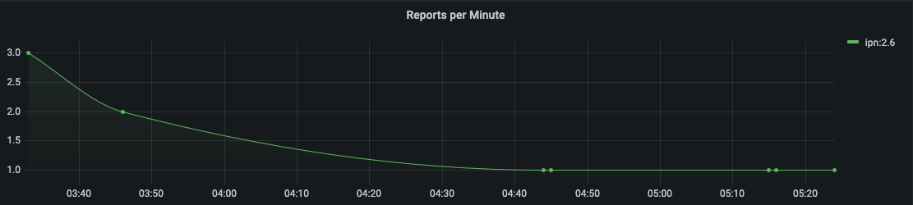

The _Reports per Minute_ visualization in the top of the Monitor tab displays the rate of reports generated by Agents and stored in the database by the Manager.

===== Received Reports

The first table on the Monitor tab displays information from all reports the Manager has received and stored. The values in this table are organized by type; the report template needs to be used to decode the report entry values.

The report entries are populated with:
* Time the report was received
* ID of the Agent that generated the report
* Correlator Nonce of the execution set that trigger the report generation 
* Values included in the received report in string format 
* Values included in the received report in binary format  

[#fig-received-reports]
.Received Reports Sample Table
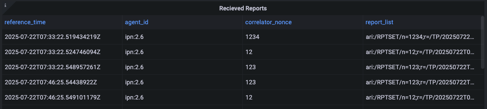

===== ARIs

The second table on the Monitor tab displays all of the ARIs stored in the database. These resource identifiers are useful in showing the messages that can be built and sent to an Agent.

The ARI table entries include:
* The object metadata ID
* Data type ID
* Name of object
* Data model ID 
* Object enumeration
* Status
* reference 
* Description of the ARI
* Data model name 
* Enumeration of the data model
* Namespace typ of the data model
* Description of the data data model

[#fig-ari-table]
.ARI Sample Table

[#sec-creating-custom-panels]
==== Creating Custom Panels

The Grafana display at the bottom of the *Monitor* tab allows a user to create custom panels - graphs, charts, alerts, etc. - to visualize information gathered by the ANMS that is stored in the database. 

Navigate to the `Monitor` tab, and select `New Panel` under the Grafana section. 

[#fig-new-panel]
.Create a Custom Panel for Monitoring

A new page is then displayed; this is the Grafana's panel creation wizard.

There are three sections in the panel creator, which can be resized for easy viewing and 
editing.

[#fig-panel-creator]
.Grafana Panel Creation Wizard

*Section A*, as depicted in <<fig-panel-creator>> in the upper left box, displays a preview of what the panel you are creating will look like or 
will show an error screen if it can not be generated.

[#fig-panel-data]
.Sample Panel Data Selection from the amp-core Database
image::images/panel-data.png[]

*Section B*, in the bottom left of <<fig-panel-creator>>, is where you select the data you would like to display in your custom panel. 
It is best to resize this section to easily set up the data you would like to view. 

Under `data source`, you can select which database to use. `amp_core` is a PostgreSQL database for ANMS that contains health and status for the 
ANMS system and stores the information generated and used by the AMP network manager. The `amp-core` database is selected in the sample query 
provided in <<fig-panel-data>>.

*Section C*, on the right side of <<fig-panel-creator>>, provides the settings for the panel. You can edit the title of the graph, the type of 
graph, and other attributes.

To build out a Grafana panel, select the `amp_core` database to display data from the manager. Then, choose the table or view from the database 
that you wish to display. 

NOTE: Not every table has a timestamp entry, so you might need to change the type of graph you are attempting to use if data is not displaying as expected. You can change the type of graph you would like to use in Section C. 

Next, select the columns you would like to use. The `Generate SQL` option may be useful to you if you are familiar with SQL.

Once the data for the panel is selected, you can preview the graph in Section A. 

The `Query Inspector` button will display the results of the SQL query and is useful for debugging if the panel is not displaying correctly.

Additional information on the use of Grafana to build panels can be found in the detailed documentation available online <<grafana-docs>>, including a tutorial on building a <<grafana-dashboard>> and instructions on how to customize <<grafana-panels>>.

[#sec-agents]
=== Agents

The *Agents* tab can be used to search for Agents known to the ANMS, get additional information on these Agents, and add new Agents to the system.

The search bar at the top of the page allows a user to search the Agents known to the ANMS by:

* ID String (Example: ipn:1.1)
* Time Agent was First Registered (Example: 2023-02-16T19:44:20.805658)
* Time Agent was Last Registered (Example: 2023-03-20T17:13:41.284906)

[#fig-agent-search]
.Search for Agents Known to the ANMS
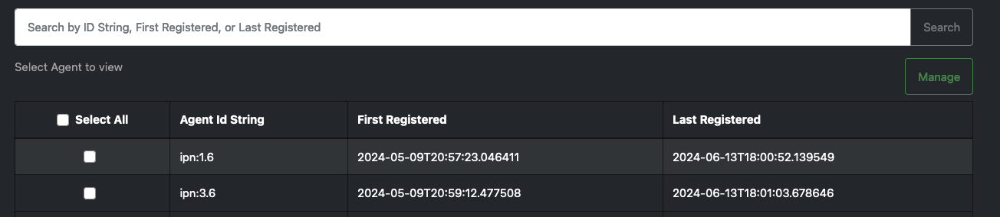

The table in the middle of the Agents page displays the Agents registered with the ANMS, giving the Agent ID String and the times that agent was first and last registered. 

For additional information on a specific Agent, click a row in the table. The Agent details are displayed, including:

* Registered Agent ID
* Agent ID String
* Time Agent was First Registered
* Time Agent was Last Registered

[#fig-agent-details]
.Detailed Agent Information Provided by the ANMS
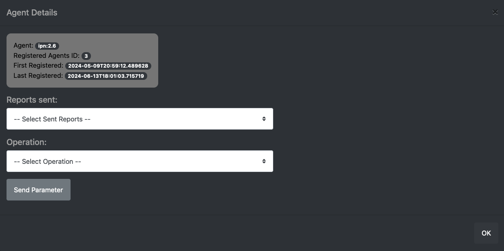

The first dropdown, labeled "Select Sent Reports" provides a list of reports that an Agent has sent. 

[#fig-agent-reports-sent]
.The Agent Sent Reports Dropdown Menu
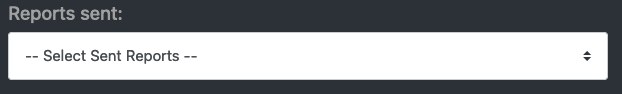

Select a report from the list for additional data.

[#fig-agent-select-sent-report]
.Selecting a Report Sent by the Agent
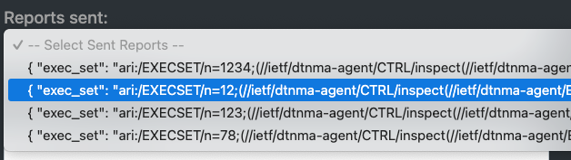

[#fig-agent-report-print]
.Displaying a Report
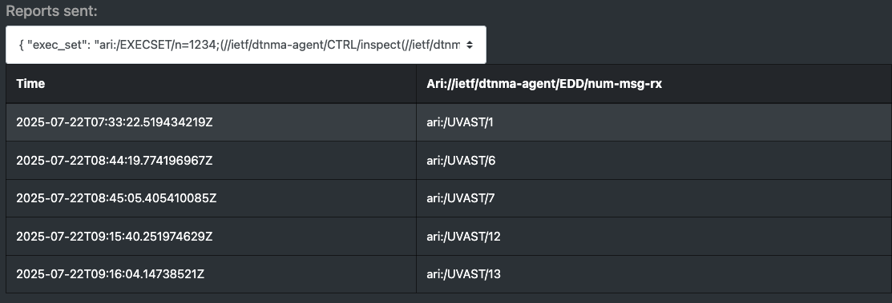

The second dropdown menu allows the user to build a command to send to the currently selected Agent. 
The `Select Operation` dropdown can be used to select the operation for the command, and the text box to the right accepts any parameters, 
as a comma separated list, necessary for that command. 
Click the `Send Parameter` button to send the control to the agent. 

[#fig-agent-operation]
.Select an Operation and Parameter to Build a Control to Send to the Agent
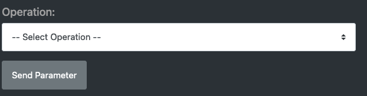

Adding an Agent to the ANMS can be done from the Agents page as well. Enter the Address of the Agent to add to the ANMS, and select the `Add Node` button.

[#fig-agent-add]
.Add an Agent to the ANMS
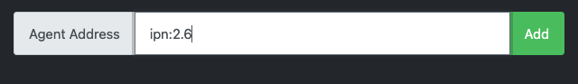

To manage an Agent(s), select the agent(s) to be managed from the agent table, then select the manage button in the upper right part of the table. 

[#fig-agent-manage]
.Manage an Agent 
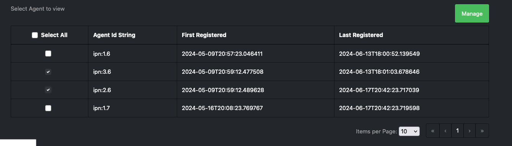

From this Agent management menu, the user can:
1. Generate a new ARI to send to the agent(s)
1. Send a prebuilt string ARI to the agent(s)

[#fig-agent-manage-menu]
.The Agent Management Menu
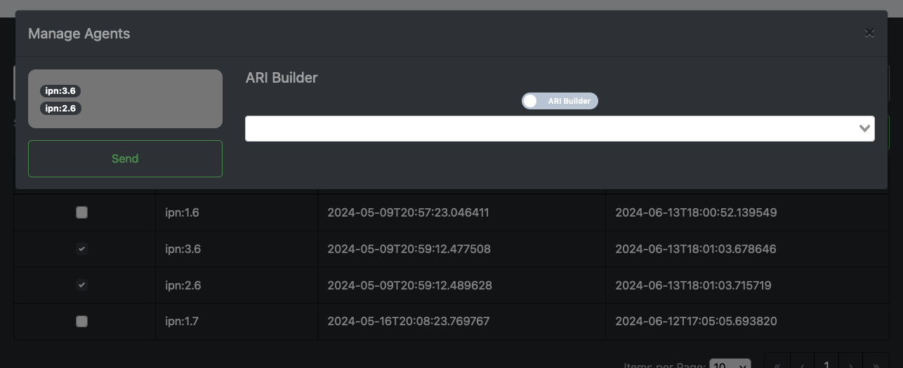

The manage tab uses the same system as the build tab to generate ARIs. See Build on how to generate new ARIs.
A user will be able to preview the generated ARI before sending it to the agent(s). A status indicator will be displayed as the ARI is being translated

[#fig-agent-manage-ari-done]
.The Agent Management Preview ARI
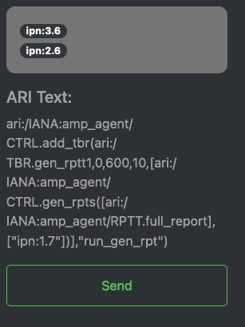

[#fig-agent-manage-wating]
.The Agent Management Waiting Indicator

After the ARI is translated and successfully sent to the manager to be forwarded to the agent(s), a status toast will be displayed.

[#fig-agent-manage-toast]
.The Successful Managed Agent Toast

=== Build

[#fig-build-tab]
.Select the Build Tab of the ANMS
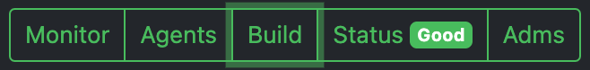

The *Build* tab is for used for generating ARIs, translating string ARIs to CBOR, and sending those ARIs to the ANMS database and/or Agent(s). All ARIs in the ANMS database can be used to generate new string ARIs using the `ARI Builder` that can be translated using the `ARI String Input` option. To switch between building and translating ARIs, use the toggle at the center of the screen beneath the menu bar.

When first navigating to this tab, the ANMS compiles all known ARIs, including their parameter information, from the database. 

==== ARI String Input

[#fig-string-input]
.ARI String Input Toggle
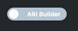

The ANMS transcodes string ARIs to CBOR, which can then be sent to Agents. To perform this translation, toggle the switch at the top of the screen to select the ARI *String Input* option. 

[#fig-ari-string-transcode]
.ARI String Transcoder

In the top input box, enter a string ARI (Ex: "ari://ietf/dtnma-agent/EDD/num-msg-rx") and select the `SUBMIT` button to transcode the given ARI. The CBOR generated by the ANMS will be populated in the table below the input options on the page, as shown in <<fig-transcoded-aris>>.

[#fig-ari-search]
.Search Transcoded ARIs

To search the ARIs that have been transcoded by the ANMS, enter one of the following:
1. Transcoder Log ID
2. String ARI (URI)
3. CBOR 

Next to the search button is the refresh button that can be used to refresh the entries in transcoder log id table. Entries are updated when new entries are submitted or when switching between pages. 

[#fig-transcoded-aris]
.Transcoded ARIs with String and CBOR Versions Shown
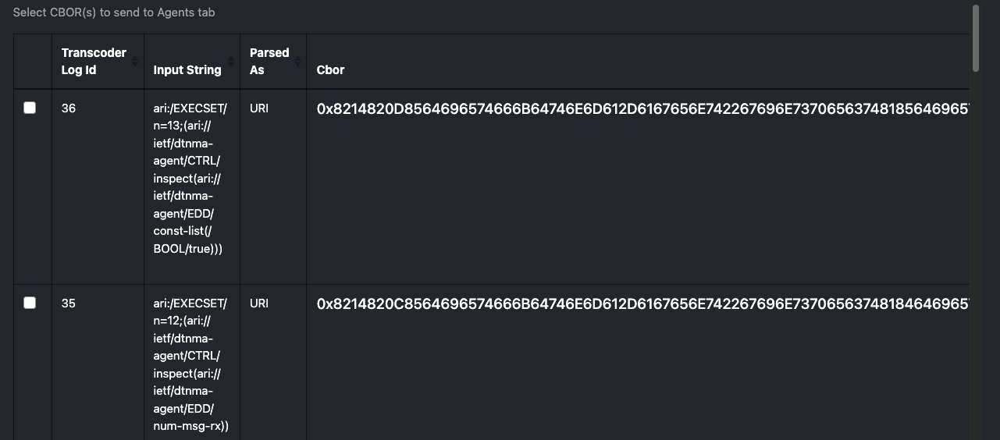

The transcoded ARIs are presented in the table at the bottom of the Build tab. The table provides the Transcoder Log ID, String form of the ARI, a description of what the provided string was parsed as (currently, all string input is parsed as a URI), the CBOR translation for the ARI, the URI, and details on transcoding errors if an issue with the input was detected. 

==== ARI Builder

[#fig-ari-builder-toggle]
.ARI Builder Toggle
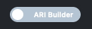

The ANMS allows a user to build ARIs from existing ADMs. To begin building an ARI, type in the search bar as shown in <<fig-ari-build-search>> to filter available ARIs by type, ADM, or name. 
Also there is a checkbox to toggle if the ARI will be apart of an execution set. When selected a new correlator_nonce field will appear where a user can populate with a unique nonce that is used to track report sets generated  by the execution set.

[#fig-ari-build-search]
.ARI Search Bar
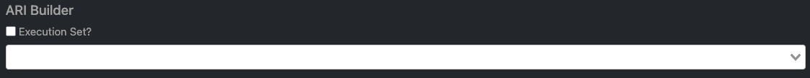

The user may also choose an ARI from the drop down list, as shown in <<fig-ari-search-dropdown>>.

[#fig-ari-search-dropdown]
.Search Available ARIs 

If the chosen ARI has parameters, input boxes will be provided for each required field. The parameters will be displayed as a comma separated list after the name of the ARI. 
ARIs with complex parameters include additional guidance for populating these required fields. For instance, an ARI Collection (AC) builder is provided for ARIs requiring an AC parameter, as shown in <<fig-simple-ari-param>>. The left side of the screen allows a user to search for the ARI they want to add to the AC and the right-hand side of the screen displays the selected ARI(s). 

[#fig-simple-ari-param]
.ARI Parameter Input
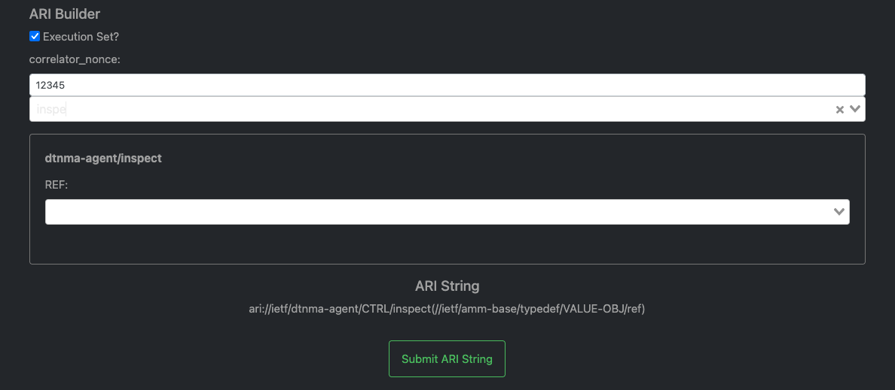

ARI parameters can be searched and selected from a dropdown menu, similar to the search to initiate the ARI build process.

[#fig-ari-param-dropdown]
.Selecting an ARI Parameter

When an ARI is selected from the search box on the left, it is populated in the box below, `Selected ARIs`. The finale ARI is updated automatically as new ARIs are added or removed from the AC.

[#fig-ari-param-in-ac]
.ARI Parameter Added to an AC
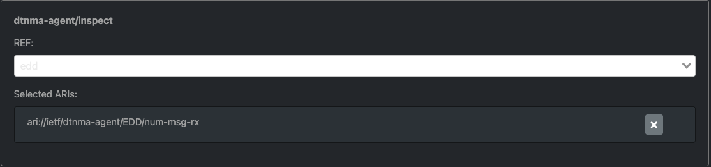

For parameters that also require parameters, the system will generate additional input fields.

[#fig-ari-param-in-ac-filled]
.ARI Parameter Added to an AC with its own parameter
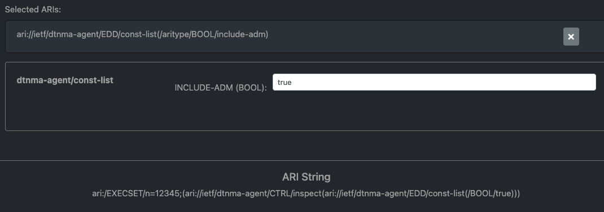

After all ARI parameters have been filled in, the system will generate the new string URI that is shown beneath the parameter fields. This string URI is sent via anms-core to the transcoder to be translated. The final result of the translation is displayed in the table at the bottom of the page, as depicted in <<fig-completed-ari-build>>. 

[#fig-pending-ari-build]
.ARI in "pending" State

NOTE: An ARI that is currently being translated by the ANMS will be marked as "pending" in the `Parsed As` field of the transcoded ARI table, as pictured in <<fig-pending-ari-build>>. When the ARI translation is complete, the `Parsed As` field will be updated to show the provided format of the ARI.   

[#fig-completed-ari-build]
.Translated ARI with Input String and CBOR Output

To start building a new ARI simply select the 'X' clear selected button on the right hand side of the search bar. This will reset the builder screen, making it ready for the user to select a new ARI to build. 

[#fig-reset-ari-build]
.reset ari builder area

The transcoded ARI table provides the following information:

.Transcoded ARI Table Contents
|===
|Column Label | Description | Type | Sample Value | Notes  

| Transcoder Log ID 
| The ID of the transaction.
| UINT
| 38
| Used primarily for debugging purposes.

| Input String
| The user input sent to the Transcoder.
| String
| `ari://ietf/dtnma-agent/EDD/num-msg-tx`
| The URI string shown below the search bar on the ARI Build tab.

| Parsed As
| The determined format of the Input String.
| STR
| URI
| Set to "pending" while transcoding is in progress. Set to "URI" if provided input is successfully parsed as a URI. Set to "ERROR" if an error was encountered while translating, see ARI column for the error reported.

| CBOR
| The CBOR generated from the Input String.
| Hex
| 0x8464696574666B64746E6D612D6167656E74236A6E756D2D6D73672D7478
| Agent-parsable ARI.

| Ari
| Details regarding ARI parsing from the transcoder. 
| STR
| "Failed to process: Error decoding from `ari://ietf/dtnma-agent/CTRL/ensure-tbr(//ARITYPE/NAMESPACE/ietf,//ietf/amm-base/typedef/id-text(tbr_1),//ietf/amm-base/typedef/id-int(0),ari://ietf/dtnma-agent/CTRL/inspect(ari://ietf/dtnma-agent/EDD/num-msg-rx),/TD/5,/TD/10,/UVAST/10,/UVAST/10,/BOOL/true)`: Failed to parse \"ari://ietf/dtnma-agent/CTRL/ensure-tbr(//ARITYPE/NAMESPACE/ietf,//ietf/amm-base/typedef/id-text(tbr_1),//ietf/amm-base/typedef/id-int(0),ari://ietf/dtnma-agent/CTRL/inspect(ari://ietf/dtnma-agent/EDD/num-msg-rx),/TD/5,/TD/10,/UVAST/10,/UVAST/10,/BOOL/true)\": Syntax error in input at: LexToken(COMMA,',',1,63)"
| Set to a populated "ReferenceARI" object if transcoding was successful. 

| Uri
| The URI generated from the user input.
| STR
| "ari:/EXECSET/n=13;(//ietf/dtnma-agent/CTRL/inspect(//ietf/dtnma-agent/EDD/const-list(/BOOL/true)))"
| Set to "" if transcoding was unsuccessful. Should be the same value of "Input String" if "type" is "URI". Consult the Ari field for further details on parsing/processing errors.

|===

The ANMS-generated CBOR in the table provides ARIs in the format Agents expect. To send the CBOR ARI to an Agent, click the value in the table. This will display all registered Agents. When an Agent is selected, the details for that Agent and the option to send a CBOR ARI is provided. This process is discussed in detail in <<sec-agents>>.

Also included  int the transcoder log table are checkboxes that can be used to send multiple ARI to the agents page at once. The values will be sent to the agents in the order in which they are selected in the transcoder log table. There is a button at the bottom of the table labeled `Send to Agents` that can be selected to send the ARIS to the Agents page. 

=== Status

[#fig-status-tab]
.Selecting the Status Tab with System Health Indicated as Good
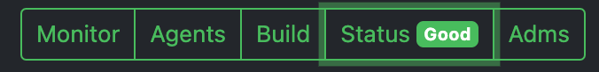

The Status page provides a summary of the overall health and status of the ANMS services. If all ANMS containers are up and running, a green "Good" label is included in the Status tab header. Selecting the Status page provides a list of the ANMS services and their individual statuses. All statuses will be set to "running" and displayed in green to indicate that the overall health of the ANMS system is good.

Select the "Check Service Status" button to refresh the health and status data displayed for the ANMS services.

This service is dependent on the anms-core service, so if it is in an error state then this page will display an `AxiosError: Request failed with status code 502` error message. 

[#fig-status]
.ANMS Status

=== ADMs

[#fig-adms-tab]
.Selecting the ADMs Tab

The ADMs page of the ANMS displays the Application Data Models (ADMs) known to the system, and allows a user to upload additional ADM files. 

==== Displaying Supported ADMs

Selecting the "Get ADMs" button, a user can refresh the table of supported ADMs. The table displays the Enumeration, Name, Namespace, Version, and Use Description associated with each ADM.

[#fig-adms-table]
.Supported ADMs
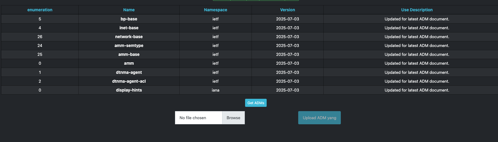

==== Downlaoding ADMs

Selecting an ADM's name will download the associated yang file.

[#fig-adm-download]
.Downlaoding ADM

==== Adding ADMs 

The file selection option at the bottom of the ADMs page allows a user to add an ADM to the ANMS.
Selecting the "Browse" button, the user can select any JSON ADM file from their local filesystem. Selecting the blue "Upload adm yang" button will upload the file and the ADM information is populated in the table above. 
Uploading an ADM causes updates to the ANMS database but will not extend these changes to registered agents. Updating individual agents would be an action that is specific to the environment in which the registered agents are deployed in. 

[#fig-add-adm]
.Add an ADM by Uploading a JSON file
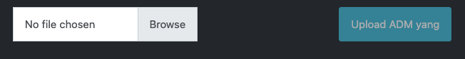

If the new ADM is not displayed in the table, it may be necessary to click the "Get ADMs" button to refresh the table contents.

== Workflows

The workflows presented in the following sections provide examples of common ANMS use cases and a walkthrough of the steps taken to produce the described results.

=== Display Data with a Custom Grafana Panel

The *Monitor* tab of the ANMS allows a user to construct custom panels for data visualization using Grafana, as discussed in <<sec-creating-custom-panels>>. 
This sample workflow shows the construction of a custom panel to view a report variable for an AMP agent, 
but can be modified to plot any data points of interest within the ANMS UI.

In this example, the user wants to know the number of times a report message is sent by a particular agent. 
This can be achieved using Graphana to plot the `num-msg-rx` EDD defined in the dtnma-agent ADM. An execution set containing the `(ari://ietf/dtnma-agent/CTRL/inspect("ari://ietf/dtnma-agent/EDD/num-msg-rx")` control would of had to be sent to the agent to generate these results.  This example uses the execution set `ari:/EXECSET/n=1234;(ari://ietf/dtnma-agent/CTRL/inspect("ari://ietf/dtnma-agent/EDD/num-msg-rx"))` 

Grafana uses SQL queries to pull data from the ANMS database and display it to the user. 

The code block below is an SQL query that will retrieve all report information in the ANMS database. 
This is the starting point for plotting any information from reports received by the Manager. 
This query is the same as the one used to generate the _Received Reports_ Grafana panel in the ANMS UI's default configuration. 

.SQL Query for All Report Information
[source,sql]
----
-- all reports 
SELECT 
    reference_time,
    agent_id, 
    correlator_nonce,
    report_list
FROM
    ari_rptset
----

To plot a specific variable from a specific execution_set use a where clause to select only report sets that match the correlator_nonce for the execution_set that contains the needed information, for this example the correlator_nonce 1234 was used.
In the example below, in order to retrieve the `num-msg-rx` value, we need to incorporate an SQL `REGEXP_MATCHES` function to separate entries in the `report_list` field. 
The execution_set used the inspect control that takes one parameter, the element you want to generate values for, so for this example that parameter is `num-msg-rx` which means the report sets generated will only contain one value. We can then generate a regular express, `'^.*;\(/UVAST/(\d+)\)\)$'`,  that pulls the /UVAST/ value ( the only value in the report set) from the `report_list` field. 
Finally, we cast the value to the proper type. Now the query <<sql-tbr-query>> can be executed to extract the data needed to generate a Grafana graph.

[#sql-tbr-query]
.SQL Query for Number of Time-Based Rules Run by an Agent
[source,sql]
----
SELECT 
    floor(extract(epoch from reference_time::timestamp)/60)*60 as time,
    (REGEXP_MATCHES(report_list,'^.*;\(/UVAST/(\d+)\)\)$'))[1]::int as value,
    agent_id AS metric
FROM ari_rptset 
where correlator_nonce = 1234
group by 1, agent_id, report_list
order by time asc
----

To use this SQL query and extract the relevant data, toggle Grafana to text-edit mode, then insert the SQL. 

[#fig-text-edit]
.Toggle for Text-Edit Mode in Grafana

After inserting the formatted query, a sample visualization will be displayed. 

[#fig-sample-tbr-results]
.Sample Time-Based Rule Execution Visualization

After setting final options, such as graph title, the panel is ready to be saved and viewed on the Monitor tab.  

[#fig-tbr-panel]
.Time-Based Rule Panel Displayed on Monitor Tab
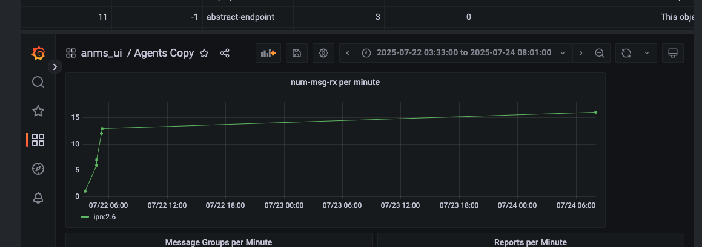

In this sample panel, the number of report message generated  by each registered Agent is plotted over the period of time the Manager has been receiving data.
To refine the timeframe the data is shown for, edit the SQL query to include a condition in the `WHERE` block. 

=== Receiving Agent Data

Agents in the ANMS can be configured to monitor applications and services. The data they produce can be requested by a Manager as a report or 
table, depending on the associated data template, and viewed either on the `Agents` tab of the ANMS, or used to produce custom Grafana 
visualizations on the `Monitor` tab.

==== Generate a Report

To generate a report, the `inspect` or `report-on` control can be used. 
`inspect` accepts one parameter:
1. An ARI of the object(EDD, CONST, or VAR) that you would like to report the value of 

`report-on`  accepts two parameters:
1. An ARI Collection (AC) specifying the report template(s) that should be populated by the Agent.
2. A endpoint-or-uri identifying the Manager(s) that are the intended recipients of the report(s). Can be null.

First, navigate to the `Build` tab of the ANMS and toggle the switch at the top to use the ARI Builder. Check the Execution set box and enter in a unique nonce.
In the ARI search box, find the  AMP Agent `report-on` or `inspect` control.
`ari://ietf/dtnma-agent/CTRL/report-on(//ietf/amm-base/typedef/rpt-tgt/template,//ietf/network-base/typedef/endpoint-or-uri|/aritype/null/destinations)`
`ari://ietf/dtnma-agent/CTRL/inspect(//ietf/amm-base/typedef/VALUE-OBJ/ref)` 

[#fig-gen-rpt-search]
.Inspect ARI

Next, the parameters for the control must be chosen. Select the object to be populated by the Agent. 

[#fig-rptt-search]
.Search for objects 
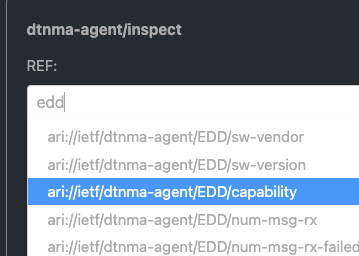

For this sample workflow, the `num-exec-succeeded` EDD is seleceted with the `Inspect` control.

[#fig-rptt-selected]
.Full execution set with inspect control
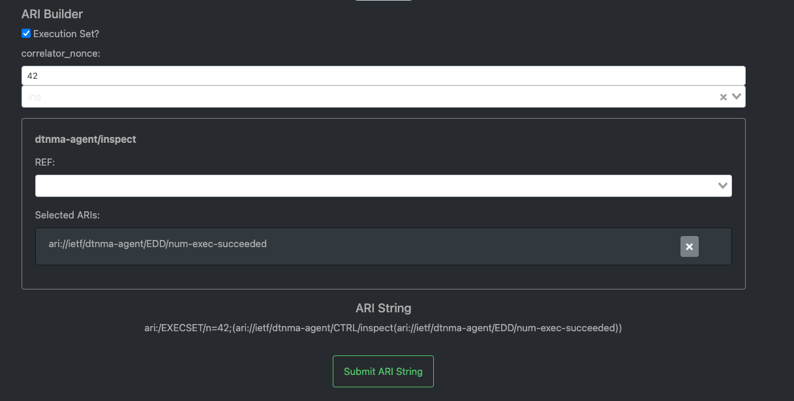

The system create the AC and any additional parameter fields as needed. `num-exec-succeeded` does not require any parameters, 

Now that all the parameters are filled out, select the `SUBMIT ARI String` button which will generate the string ARI. This string ARI is sent to the 
transcoder and will be available in the lower table after it has ben processed.

*Resulting String ARI:* `ari:/EXECSET/n=42;(ari://ietf/dtnma-agent/CTRL/inspect(ari://ietf/dtnma-agent/EDD/num-exec-succeeded))`
*CBOR:* `0x821482182A8564696574666B64746E6D612D6167656E742267696E7370656374818464696574666B64746E6D612D6167656E7423726E756D2D657865632D737563636565646564`

[#fig-transcoded-rpt-ari]
.Generate Report ARI and CBOR Representations
image::images/transcoded-rpt-ari.png[]

Now that the control has been built, the CBOR can be sent to the desired Agent(s). Click the CBOR entry for the translated ARI and 
the UI will redirect to the `Agents` tab.

From the available agent table, select the Agent(s) to send the control to. In <<fig-managed-agent>>, the Agent address selected ipn:2.6.

[#fig-managed-agent]
.Manage Agent ipn:2.6
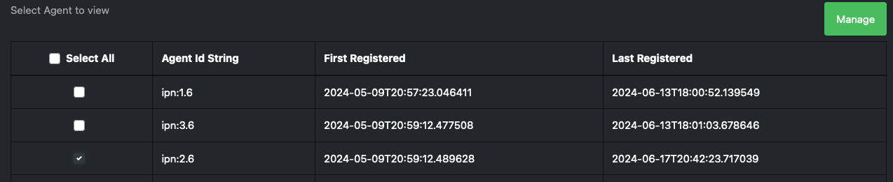

Select the `Manage` button to open a menu of options for Agent handling. The input field for a `Text Input` will be auto-filled 
with the CBOR selected from the *Build* tab. Select the `Submit` button and then `Send` to send the CBOR command to the Agent.

[#fig-raw-cmd]
.Auto-filled CBOR in RAW Command Field
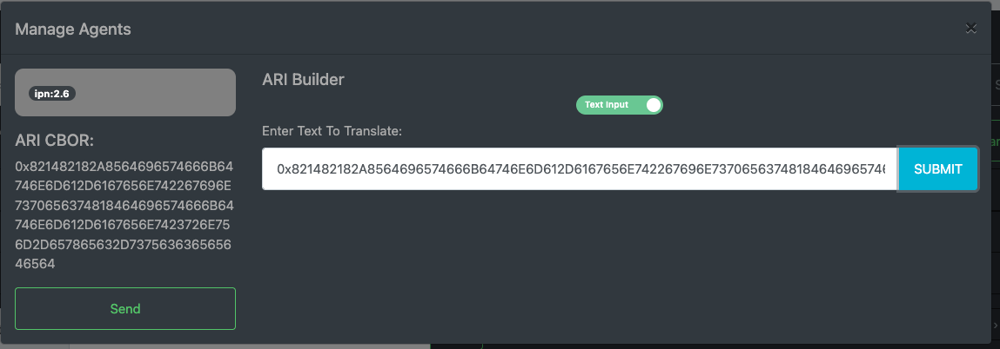

After successfully sending the control to the Agent a success popup should be displayed in the upper right portion of the screen.

TODO
[#fig-transcoded-rpt-ari2]
.Generate Report ARI and CBOR Representations
image::images/transcoded-rpt-ari.png[]

Now that the control has been built, the CBOR can be sent to the desired Agent(s). Click the CBOR entry for the translated ARI and 
the UI will redirect to the `Agents` tab.

At the bottom of the page, fill in the address of the Agent (or a comma separated list if providing multiple Agents) to send the 
control to. In <<fig-managed-agent2>>, the Agent address is ipn:2.6.

[#fig-managed-agent2]
.Manage Agent ipn:2.6

Select the `Manage` button to open the modal for Agent handling. The input box for a `Text Input` will be auto-filled 
with the CBOR selected from the *Build* tab. Select the `Submit` button to send the CBOR command to the Agent.

TODO
[#fig-raw-cmd2]
.Auto-filled CBOR in RAW Command Field

After successfully sending the control to the Agent a success popup should be displayed in the upper right portion of the screen.

TODO
[#fig-cmd-success2]
.Command Sent Successfully

=== Defining Agent Rules

Rules are still under Development in `DTNMA-tools` which is the system ANMS is currently using to handle agent management/

== Product Support

There are two levels of support for the ANMS: troubleshooting by the administrator or user attempting to operate the ANMS, which is detailed in <<sec-troubleshooting>>, and upstream support via the ANMS public GitHub project, accessible as described in <<sec-contact>>.
Attempts to troubleshoot should be made before submitting issue tickets to the upstream project.

[#sec-troubleshooting]
=== Troubleshooting

The following situations provide troubleshooting guidance for the ANMS from the perspective of a normal or administrative user, typically operating the ANMS via a web browser.
Each situation consists of an observed state followed by a recommended troubleshooting activity.

[qanda]
The Grafana panels in the `Monitor` tab displays `Connection was reset` errors::
The Grafana container may not have started successfully. Contact a system administrator to restart the component. 

An Agent is not present in the `Agents` tab on start up::
This is likely due to an error in one of the ION containers and their connection to the underlying database. Contact a system administrator to restart the component.

Registering a new Agent does not result in an update to the displayed Agents in the ANMS Agent tab::
Contact a system administrator to verify that the Agent has been registered to the Manager via CLI tools.

[#sec-contact]
=== Contacting or Contributing

The ANMS is hosted on a GitHub repository <<anms-source>> with submodule references to several other repositories.
There is a https://github.com/NASA-AMMOS/anms/blob/main/CONTRIBUTING.md[`CONTRIBUTING.md`] document in the ANMS repository which describes detailed procedures for submitting tickets to identify defects and suggest enhancements.

Separate from the source for the ANMS proper, the ANMS Product Guide and User Guide are hosted on a GitHub repository <<anms-docs>>, with its own https://github.com/NASA-AMMOS/anms-docs/blob/main/CONTRIBUTING.md[`CONTRIBUTING.md`] document for submitting tickets about either the Product Guide or User Guide.

While the GitHub repositories are the primary means by which users should submit detailed tickets, other inquiries can be made directly via email to the the support address mailto:dtnma-support@jhuapl.edu[,ANMS Support].

[index]
== Index
